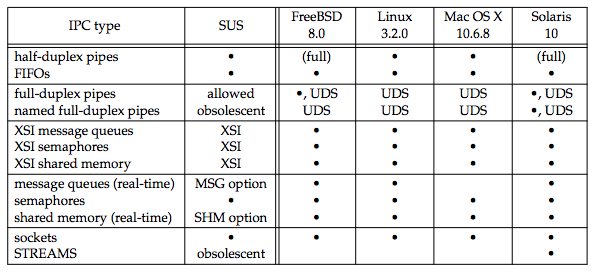

### **Chapter 15. Interprocess Communication**

This chapter discusses other techniques for processes to communicate with one another: interprocess communication (IPC).

The figure below summarizes the various forms of IPC that are supported by the four implementations discussed in this text.

* The "SUS" column allows an implementation to support full-duplex pipes, but requires only half-duplex pipes.
* "(full)" shows implementations that support half-duplex pipes by using full-duplex pipes.
* The bullet means that basic functionality is supported.
* "UDS" means that the feature of full-duplex pipes can be provided through UNIX domain sockets

[p533-534]

The first ten forms of IPC in the figure above are usually restricted to IPC between processes on the same host. The final two rows: sockets and STREAMS, are the only two forms that are generally supported for IPC between processes on different hosts.

This chapter dicusses classical IPC: pipes, FIFOs, message queues, semaphores, and shared memory.

### Pipes
