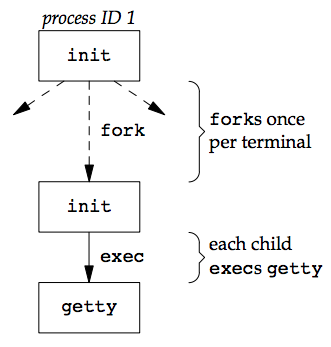

### **Chapter 9. Process Relationships**

### Introduction

Every process has a parent process (the initial kernel-level process is usually its own parent). The parent is notified when the child terminates, and the parent can obtain the child’s exit status.

This chapter details process groups and the concept of session introduced by POSIX.1, as well as relationship between the login shell that is invoked when a user logs in and all the processes that are started from the login shell.

The concept of UNIX system signal mechanism in [Chapter 10](/apue/ch10.md) is needed.

### Terminal Logins

In early UNIX systems, the terminals (dumb terminals that are hard-wired connected to the host) were either local (directly connected) or remote (connected through a modem). These logins came through a terminal device driver in the kernel. [p285]

As bitmapped graphical terminals became available, windowing systems were developed to provide users with new ways to interact with host computers.  Applications were developed to create "terminal windows" to emulate character-based terminals, allowing users to interact with hosts in familiar ways (i.e., via the shell command line).

Today, some platforms allow you to start a windowing system after logging in, whereas other platforms automatically start the windowing system for you. In the latter case, you might still have to log in, depending on how the windowing system is configured (some windowing systems can be configured to log you in automatically).

The procedure that we now describe is used to log in to a UNIX system using a terminal. The procedure is similar regardless of the type of terminal we use. It could be a:

* character-based terminal,
* a graphical terminal emulating a simple character-based terminal,
* or a graphical terminal running a windowing system.

#### BSD Terminal Logins

The file `/etc/ttys` (created by the system administrator) has one line per terminal device. Each line specifies the name of the device and other parameters (e.g. baud rate) that are passed to the `getty` program.

After the system is bootstrapped, the kernel creates the `init` process (PID 1) which brings the system up in multiuser mode. The `init` process reads the file `/etc/ttys` and, for every terminal device that allows a login, does a `fork` followed by an `exec` of the program `getty`.

All the processes shown in the figure above have a real user ID of 0 and an effective user ID of 0 (they all have superuser privileges).

* The `init` process `exec`s the `getty` program with an empty environment.
* `getty` calls `open` to open terminal device for reading and writing. File descriptors 0, 1, and 2 are set to the device.
* Then, `getty` outputs something like `login:` and waits for us to enter our user name. `getty` can detect special characters to change the terminal's speed (baud rate). [p287]

