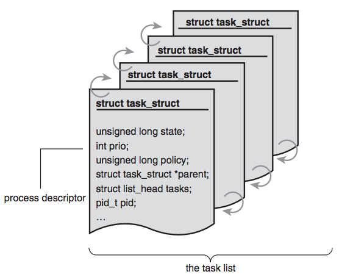
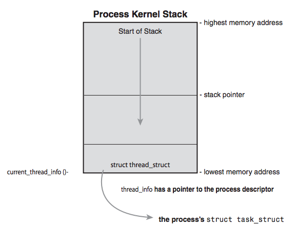
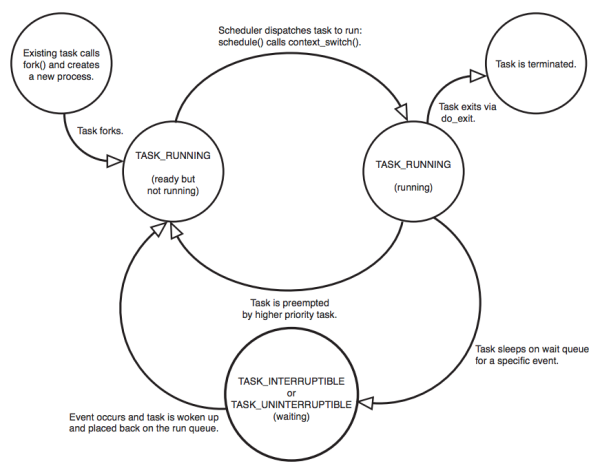

### **Chapter 3. Process Management**

This chapter introduces the concept of the **process**. The process management is a crucial part of any operating system kernel, including Linux. 

### The Process

A process is a program (object code stored on some media) in the midst of execution.

Besides the executing program code (*text section* in Unix), processes also include a set of resources:

* Open files 
* Pending signals
* Internal kernel data
* Processor state
* Memory address space with one or more memory mappings
* **Thread(s) of execution**
* Data section containing global variables

#### Threads of execution

Threads of execution, often shortened to **threads**,  are the objects of activity within the process.

Each thread includes:

* Program counter
* Process stack
* Set of processor registers

The kernel schedules individual threads, not processes. <u>Linux does not differentiate between threads and processes. To Linux, a thread is just a special kind of process.</u>


#### Virtualized processor and virtual memory

On modern operating systems, processes provide two virtualizations: a **virtualized processor** and **virtual memory**.

* The virtual processor gives the process the illusion that it alone monopolizes the system, despite possibly sharing the processor among hundreds of other processes. See [Chapter 4. Process Scheduling](/lkd/ch4/).
* Virtual memory lets the process allocate and manage memory as if it alone owned all the memory in the system. See [Chapter 12. Memory Management](/lkd/ch12/)

<u>Threads share the virtual memory abstraction</u>, whereas each receives its own virtualized processor.


#### Life of a process

A process is an active program and related resources:

* Two or more processes can exist that are executing the *same* program.
* Two or more processes can exist that share various resources, such as open files or an address space.

#### fork, exec, exit and wait

In Linux, the `fork()` system call creates a new process by duplicating an existing one.

* The process that calls `fork()` is the parent, whereas the new process is the child.
* The parent resumes execution and the child starts execution at the same place: where the call to `fork()` returns.
* The `fork()` system call <u>returns from the kernel twice: once in the parent process and again in the newborn child.</u>

The `exec()` family of function calls creates a new address space and loads a new program into the newborn child immediately after a fork. In contemporary Linux kernels, <u>`fork()` is actually implemented via the `clone()` system call</u>, which is discussed in a following section.  

The `exit()` system call terminates the process and frees all its resources. A parent process can inquire about the status of a terminated child via the `wait4()` system call. A process can wait for the termination of a specific process. <u>When a process exits, it is placed into a special zombie state that represents terminated processes until the parent calls `wait()` or `waitpid()`.</u> The kernel implements the `wait4()` system call. Linux systems, via the C library, typically provide the `wait()`, `waitpid()`, `wait3()`, and `wait4()` functions.


### Process Descriptor and the Task Structure

Another name for a process is a **task**. The Linux kernel internally refers to processes as tasks. In this book, the terms are used interchangeably, though <u>"task" generally refers to a process from the kernel’s point of view.</u>

The kernel stores the list of processes in a circular doubly linked list called the **task list**.

A **process descriptor** of the type `struct task_struct` (defined in `<linux/sched.h>`) is an element in the task list. It contains all the information about a specific process.

The `task_struct` is a relatively large data structure, at around 1.7 kilobytes on a 32-bit machine. The process descriptor contains the data that describes the executing program: open files, the process’s address space, pending signals, the process’s state, etc. See the figure below.

[](figure_3.1.png "Figure 3.1 The process descriptor and task list.")

#### Allocating the Process Descriptor

The `task_struct` structure is allocated via the **slab allocator** to provide object reuse and cache coloring (see [Chapter 12](/lkd/ch12/)). The structure `struct thread_info` lives at the bottom of the stack (for stacks that grow down) and at the top of the stack (for stacks that grow up)

[](figure_3.2.png "Figure 3.2 The process descriptor and kernel stack.")

[Errata](http://www.crashcourse.ca/wiki/index.php/Updates_to_LKD3#Figure_3.2_.28p._26.29): "struct thread_struct" should read "struct thread_info"

The `thread_info` structure is defined on x86 in `<asm/thread_info.h>` (see below code). Each task’s `thread_info` structure is allocated at the end of its stack.The task element of the structure is a pointer to the task’s actual `task_struct`:

* [arch/x86/include/asm/thread_info.h](https://github.com/shichao-an/linux-2.6.34.7/blob/master/arch/x86/include/asm/thread_info.h#L26)

```c
struct thread_info {
    struct task_struct *task;
    struct exec_domain *exec_domain;
    __u32 flags;
    __u32 status;
    __u32 cpu;
    int preempt_count;
    mm_segment_t addr_limit;
    struct restart_block restart_block;
    void *sysenter_return;
    int uaccess_err;
};
```

#### Storing the Process Descriptor

The **process identification** (PID) is numerical value, represented by the [opaque type](https://en.wikipedia.org/wiki/Opaque_data_type) `pid_t` (typically `int`), for the system to identify processes. The default maximum value is only 32,768 (that of a `short int`), although the value optionally can be increased as high as four million (this is controlled in `<linux/threads.h>`). The kernel stores this value as `pid` inside each process descriptor. [p26]

Large servers may require many more than 32,768 (maximum value) processes. <u>The lower the value, the sooner the values will wrap around, destroying the useful notion that higher values indicate later-run processes than lower values.</u> The administrator may increase the maximum value via `/proc/sys/kernel/pid_max`.

Inside the kernel, tasks are typically referenced directly by a pointer to their `task_struct` structure. In fact, most kernel code that deals with processes works directly with `struct task_struct`. Consequently, it is useful to be able to quickly look up the process descriptor of the currently executing task, which is done via the `current` macro. This macro must be independently implemented by each architecture:

* Some architectures save a pointer to the `task_struct` structure of the currently running process in a register, enabling for efficient access. 
* Other architectures, such as x86 (which has few registers to waste), make use of the fact that struct `thread_info` is stored on the kernel stack to calculate the location of `thread_info` and subsequently the `task_struct`.

##### The `current_thread_info()` function

On x86, `current` is calculated by masking out the 13 least-significant bits of the stack pointer to obtain the `thread_info` structure. This is done by the `current_thread_info()` function ([arch/x86/include/asm/thread_info.h#L184](https://github.com/shichao-an/linux-2.6.34.7/blob/master/arch/x86/include/asm/thread_info.h#L184)). The assembly is shown here:

```nasm
movl $-8192, %eax
andl %esp, %eax
```

This assumes that the stack size is 8KB. When 4KB stacks are enabled, 4096 is used in lieu of 8192.

`current` dereferences the task member of `thread_info` to return the `task_struct`:

* [include/asm-generic/current.h](https://github.com/shichao-an/linux-2.6.34.7/blob/master/include/asm-generic/current.h)

```c
current_thread_info()->task;
```

#### Process State

The `state` field of the process descriptor describes the current condition of the process.


[](figure_3.3.png "Figure 3.3 Flow chart of process states.")

Each process on the system is in exactly one of five different states. This value is represented by one of five flags:

* `TASK_RUNNING`: The process is runnable; it is either currently running or on a runqueue waiting to run. This is the only possible state for a process executing in user-space; it can also apply to a process in kernel-space that is actively running.
* `TASK_INTERRUPTIBLE`: The process is sleeping (blocked), waiting for some condition to exist. The process also awakes prematurely and becomes runnable if it receives a signal.
* `TASK_UNINTERRUPTIBLE`: This state is identical to `TASK_INTERRUPTIBLE` except that it does not wake up and become runnable if it receives a signal. This is used in situations where the process must wait without interruption or when the event is expected to occur quite quickly. Because the task does not respond to signals in this state, `TASK_UNINTERRUPTIBLE` is less often used than `TASK_INTERRUPTIBLE`.
* `__TASK_TRACED`: The process is being traced by another process, such as a debugger, via **ptrace**.
* `__TASK_STOPPED`: Process execution has stopped; the task is not running nor is it eligible to run. This occurs if the task receives the `SIGSTOP`, `SIGTSTP`, `SIGTTIN`, or `SIGTTOU` signal or if it receives any signal while it is being debugged.

#### Manipulating the Current Process State

Kernel code often needs to change a process’s state. The preferred mechanism is using:

```c
set_task_state(task, state); /* set task ‘task’ to state ‘state’ */
```

This function sets the given task to the given state. If applicable, it also provides a memory barrier to force ordering on other processors (only needed on SMP systems). Otherwise, it is equivalent to:

```c
task->state = state;
```

The method `set_current_state(state)` is synonymous to `set_task_state(current, state)`. See `<linux/sched.h>` for the implementation of these and related functions.

* [include/linux/sched.h#L226](https://github.com/shichao-an/linux-2.6.34.7/blob/master/include/linux/sched.h#L226)

#### Process Context

The program code is read in from an **executable file** and executed within the program’s address space.

* **User-space**: Normal program execution occurs in user-space.
* **Kernel-space**: When a program executes a system call or triggers an exception, it enters kernel-space. At this point, the kernel is said to be "executing on behalf of the process" and is in **process context**. When in process context, the `current` macro is valid.

Upon exiting the kernel, the process resumes execution in user-space, unless a higher-priority process has become runnable in the interim, in which case the scheduler is invoked to select the higher priority process.

A process can begin executing in kernel-space only through one of the following well-defined interfaces:

* System calls
* Exception handlers
