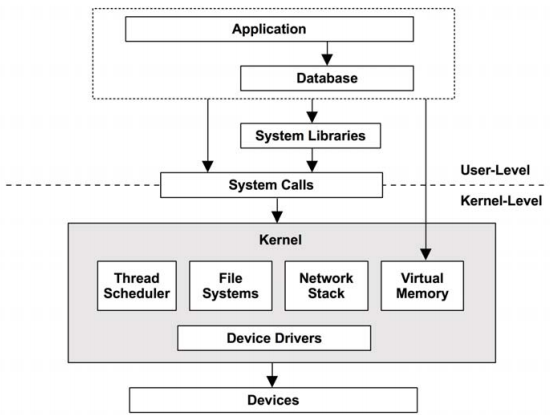

### **Chapter 1. Introduction**

This chapter introduces systems performance, describing roles, activities, perspectives, and challenges, along with latency, an essential performance metric, and some newer developments in computing: [dynamic tracing](https://en.wikipedia.org/wiki/DTrace) and cloud computing.

### Systems Performance

Systems performance is the study of the entire system, including all physical components and the full software stack. Anything in the data path (software or hardware) can affect performance. For distributed systems, this means multiple servers and applications. A diagram of an environment showing the data path help you understand the relationships between components and help ensure that you don’t overlook whole areas.

The following figure shows a generic system software stack on a single server.  The term *entire stack* sometimes refers only the application environment (including databases, applications, and web servers). In terms of systems performance, we use *entire stack* to mean everything, including system libraries and the kernel.

### Roles

[p2]

Usually, performance is a part-time activity, and there may be a tendency to explore performance only within the role’s area of responsibility (the network team checks the network, the database team checks the database, etc.). However, some performance issues requires a cooperative effort to find the root cause.

[Performance engineers](performance engineers) work with multiple teams and perform a holistic study of the environment, which is vital in resolving complex performance issues. They can also identify opportunities to develop better tooling and metrics for system-wide analysis and capacity planning across the environment.

There are also specialty application-specific occupations in the field of performance, for example, for Java performance and MySQL performance. These often begin with a limited check of system performance before moving to applicationspecific tools.

### Activities

The field of performance includes the following activities, listed in an ideal order of execution:

1. Setting performance objectives and performance modeling
2. Performance characterization of prototype software or hardware
3. Performance analysis of development code, pre-integration
4. Performing non-regression testing of software builds, pre- or post-release
5. Benchmarking/[benchmarketing](https://en.wiktionary.org/wiki/benchmarketing) for software releases
6. [Proof-of-concept](https://en.wikipedia.org/wiki/Proof_of_concept) testing in the target environment
7. Configuration optimization for production deployment
8. Monitoring of running production software
9. Performance analysis of issues

### Perspectives
