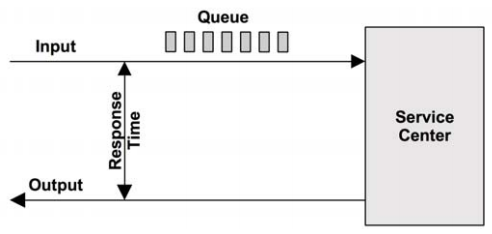

### **Chapter 2. Methodology**

Performance issues can arise from software, hardware, and any component along the data path. Methodologies help us approach complex systems by showing where to start and what steps to take to locate and analyze performance issues. [p15]

### Terminology

The following are key terms for systems performance. Later chapters provide additional terms and describe some of these in different contexts.

* **IOPS**: Input/output operations per second is a measure of the rate of data transfer operations.
    * For disk I/O, IOPS refers to reads and writes per second.
* [**Throughput**](https://en.wikipedia.org/wiki/Throughput): the rate of work performed. Especially in communications, the term is used to refer to the [data rate](https://en.wikipedia.org/wiki/Data_rate_units) (bytes per second or bits per second).
    * In some contexts (e.g., databases), throughput can refer to the operation rate (operations per second or transactions per second).
* **Response time**: the time for an operation to complete. This includes any time spent waiting and time spent being serviced (service time), including the time to transfer the result.
* **Latency**: Latency is a measure of time an operation spends waiting to be serviced.
    * In some contexts, it can refer to the entire time for an operation, equivalent to response time ([Section 2.3](#Concepts)).
* **Utilization**:
    * For resources that service requests, utilization is a measure of how busy a resource is, based on how much time in a given interval it was actively performing work.
    * For resources that provide storage, utilization may refer to the capacity that is consumed (e.g., memory utilization).
* **Saturation**: the degree to which a resource has queued work it cannot service.
* **Bottleneck**: In system performance, a bottleneck is a resource that limits the performance of the system. Identifying and removing systemic bottlenecks is a key activity of systems performance.
* **Workload**: The input to the system or the load applied is the workload. For a database, the workload consists of the database queries and commands sent by the clients.
* **Cache**: a fast storage area that can duplicate or buffer a limited amount of data, to avoid communicating directly with a slower tier of storage, thereby improving performance. For economic reasons, a cache is smaller than the slower tier.

### Models

#### System under Test

The performance of a [system under test](https://en.wikipedia.org/wiki/System_under_test) (SUT) is shown below:

**Perturbations** (interference) can affect results, including those caused by:

* Scheduled system activity,
* Other users of the system,
* Oher workloads.

The origin of the perturbations may not be clear and determining it can be particularly difficult in some cloud environments, where other activity (by guest tenants) on the physical host system is not observable from within a guest SUT.

Another difficulty is that modern environments may be composed of several networked components needed to service the input workload, including load balancers, web servers, database servers, application servers, and storage systems. The mere act of mapping the environment may help to reveal previously overlooked sources of perturbations. The environment may also be modeled as a network of queueing systems, for analytical study.

#### Queueing System

Some components and resources can be modeled as a queueing system. The following figure shows a simple queueing system.

### Concepts

#### Latency

#### Time Scales

#### Trade-offs

#### Tuning Efforts

#### Level of Appropriateness

#### Point-in-Time Recommendations

#### Load versus Architecture

#### Scalability

#### Known-Unknowns

#### Metrics

#### Utilization

#### Saturation

#### Profiling

#### Caching

### Doubts and Solutions

#### Verbatim

p17 on System under Test:

> The mere act of mapping the environment may help to reveal previously overlooked sources of perturbations. The environment may also be modeled as a network of queueing systems, for analytical study.

WTF?
