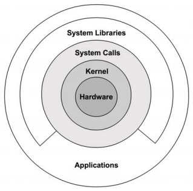

### **Chapter 3. Operating Systems**

An understanding of the operating system and its kernel is essential for systems
performance analysis, such as:

* How system calls are being performed,
* How CPUs are scheduling threads,
* How limited memory could be affecting performance,
* How a file system processes I/O.

This chapter has two parts:

* **Background** introduces terminology and operating system fundamentals.
* **Kernels** summarizes Linux and Solaris-based kernels.

### Terminology

The following is the core operating system terminology in this book:

* **Operating system**: This refers to the software and files that are installed on a system so that it can boot and execute programs. It includes the kernel, administration tools, and system libraries.
* **Kernel**: the program that manages the system, including devices (hardware), memory, and CPU scheduling. It runs in a privileged CPU mode that allows direct access to hardware, called **kernel mode**.
* **Process**: an OS abstraction and environment for executing a program. The program normally runs in **user mode**, with access to kernel mode (e.g., for performing device I/O) via **system calls** or **traps**.
* **Thread**: an executable context that can be scheduled to run on a CPU. The kernel has multiple threads, and a process contains one or more.
* **Task**: a Linux runnable entity, which can refer to a process (with a single thread), a thread from a multithreaded process, or kernel threads.
* **Kernel-space**: the memory address space for the kernel.
* **User-space**: the memory address space for processes.
* **User-land**: user-level programs and libraries (/usr/bin, /usr/lib, . . .).
* **Context switch**: a kernel routine that switches a CPU to operate in a different address space (context).
* **System call (syscall)**: a well-defined protocol for user programs to request the kernel to perform privileged operations, including device I/O.
* **Processor**: a physical chip containing one or more CPUs.
* **Trap**: a signal sent to the kernel, requesting a system routine (privileged action). Trap types include system calls, processor exceptions, and interrupts.
* **Interrupt**: a signal sent by physical devices to the kernel, usually to request servicing of I/O. An interrupt is a type of trap.

### Background

The following sections describe operating system concepts and kernel internals.

#### Kernel

The kernel manages CPU scheduling, memory, file systems, network protocols, and system devices (disks, network interfaces, etc.). It provides access to devices and kernel services via system calls. The role of the kernel is shown in the following figure:

* System libraries are often used to provide a richer and easier programming interface than the system calls alone.
    * It is pictured as a broken ring to show that applications can call system calls directly (if permitted by the operating system). [p87]
* Applications include all running user-level software, including databases, web servers, administration tools, and operating system shells.
