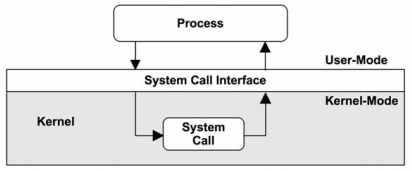
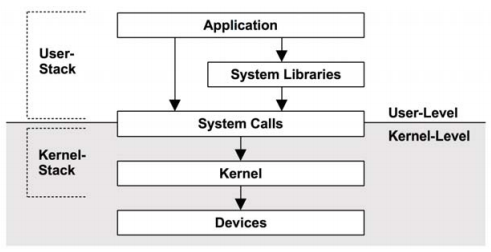
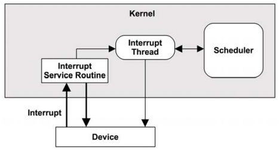

### **Chapter 3. Operating Systems**

An understanding of the operating system and its kernel is essential for systems
performance analysis, such as:

* How system calls are being performed,
* How CPUs are scheduling threads,
* How limited memory could be affecting performance,
* How a file system processes I/O.

This chapter has two parts:

* **Background** introduces terminology and operating system fundamentals.
* **Kernels** summarizes Linux and Solaris-based kernels.

### Terminology

The following is the core operating system terminology in this book:

* **Operating system**: This refers to the software and files that are installed on a system so that it can boot and execute programs. It includes the kernel, administration tools, and system libraries.
* **Kernel**: the program that manages the system, including devices (hardware), memory, and CPU scheduling. It runs in a privileged CPU mode that allows direct access to hardware, called **kernel mode**.
* **Process**: an OS abstraction and environment for executing a program. The program normally runs in **user mode**, with access to kernel mode (e.g., for performing device I/O) via **system calls** or **traps**.
* **Thread**: an executable context that can be scheduled to run on a CPU. The kernel has multiple threads, and a process contains one or more.
* **Task**: a Linux runnable entity, which can refer to a process (with a single thread), a thread from a multithreaded process, or kernel threads.
* **Kernel-space**: the memory address space for the kernel.
* **User-space**: the memory address space for processes.
* **User-land**: user-level programs and libraries (/usr/bin, /usr/lib, . . .).
* **Context switch**: a kernel routine that switches a CPU to operate in a different address space (context).
* **System call (syscall)**: a well-defined protocol for user programs to request the kernel to perform privileged operations, including device I/O.
* **Processor**: a physical chip containing one or more CPUs.
* **Trap**: a signal sent to the kernel, requesting a system routine (privileged action). Trap types include system calls, processor exceptions, and interrupts.
* **Interrupt**: a signal sent by physical devices to the kernel, usually to request servicing of I/O. An interrupt is a type of trap.

### Background

The following sections describe operating system concepts and kernel internals.

#### Kernel

The kernel manages CPU scheduling, memory, file systems, network protocols, and system devices (disks, network interfaces, etc.). It provides access to devices and kernel services via system calls. The role of the kernel is shown in the following figure:

[](figure_3.1.png "Figure 3.1 Role of the operating system kernel")

* System libraries are often used to provide a richer and easier programming interface than the system calls alone.
    * It is pictured as a broken ring to show that applications can call system calls directly (if permitted by the operating system). [p87]
* Applications include all running user-level software, including databases, web servers, administration tools, and operating system shells.

##### **Kernel Execution**

The kernel is a large program, which primarily executes on demand, when a user-level program makes a system call or a device sends an interrupt. <u>Some kernel threads operate asynchronously for housekeeping, which may include the kernel clock routine and memory management tasks, but these try to be lightweight and consume very little CPU resources.</u>

* Workloads that perform frequent I/O frequently execute in kernel context.
* Workloads that are compute-intensive are left alone as much as possible by the kernel, so they can run uninterrupted on-CPU.

It may be tempting to think that the kernel cannot affect the performance of these workloads, but there are many cases where it does. The most obvious is CPU contention, when other threads are competing for CPU resources and the kernel scheduler needs to decide which will run and which will wait. The kernel also chooses which CPU a thread will run on and can choose CPUs with warmer hardware caches or better memory locality for the process, to significantly improve performance.

##### **Clock**

A core component of the original Unix kernel is the `clock()` routine, executed from a timer interrupt. It has historically been executed at 60, 100, or 1,000 times per second (250 for Linux 2.6.13) and each execution is called a *tick*. Its functions include:

* Updating the system time
* Expiring timers and time slices for thread scheduling
* Maintaining CPU statistics
* Executing *callouts* (scheduled kernel routines)

Some performance issues with the clock are improved in later kernels, including:

* **Tick latency**: For 100 Hz clocks, up to 10 ms of additional latency may be encountered for a timer as it waits to be processed on the next tick. This has been fixed using high-resolution real-time interrupts, so that execution occurs immediately without waiting.
* **Tick overhead**: Modern processors have dynamic power features, which can power down parts during idle periods. The clock routine interrupts this process, which for idle systems can consume power needlessly. Linux has implemented [dynamic ticks](https://www.kernel.org/doc/Documentation/timers/highres.txt), so that when the system is idle, the timer routine (clock) does not fire.

Modern kernels have moved much functionality out of the clock routine to on-demand interrupts, in an effort to create a *tickless kernel*. This includes Linux, where the clock routine (which is the *system timer interrupt*) performs little work other than updating the system clock and jiffies counter (*jiffies* is a Linux unit of time, similar to *ticks*).

##### **Kernel Mode**

The **kernel mode** is a special CPU mode, where the kernel is running. This mode allows full access to devices and the execution of privileged instructions. The kernel arbitrates device access to support multitasking, preventing processes and users from accessing each other's data unless explicitly allowed.

User programs (processes) run in **user mode**, where they request privileged operations (e.g. I/O) from the kernel via system calls. To perform a system call, execution will *mode-switch* from user to kernel mode, and then execute with the higher privilege level.

[](figure_3.2.png "Figure 3.2 System call execution modes")

Each mode has its own software execution state including a stack and registers. The execution of privileged instructions in user mode causes **exceptions**, which are then properly handled by the kernel.

The switch between these modes takes time (CPU cycles), which adds a small amount of overhead for each I/O. Some services, such as NFS, have been implemented as kernel-mode software (instead of a user-mode daemon), so that they can perform I/O from and to devices without needing to switch to user mode.

If the system call blocks during execution, the process may switch off CPU and be replaced by another: a **context-switch**.

#### Stacks

A stack contains the execution ancestry for a thread in terms of functions and registers. <u>Stacks are used by CPUs for efficient processing of function execution in native software.</u>

When a function is called:

1. The current set of CPU registers (which store the state of the CPU) is saved to the stack.
2. A new stack frame is added to the top for the current execution of the thread.

When a function ends the execution and returns, it calls a "return" CPU instruction, which removes the current stack and returns execution to the previous one, restoring its state.

Stack inspection is an invaluable tool for debugging and performance analysis. Stacks show the call path to current execution, which often answers *why* something is executing.

##### **How to Read a Stack**

The following example kernel stack (from Linux) shows the path taken for TCP transmission, as printed by a debugging tool:

```text
kernel`tcp_sendmsg+0x1
kernel`inet_sendmsg+0x64
kernel`sock_aio_write+0x13a
kernel`do_sync_write+0xd2
kernel`security_file_permission+0x2c
kernel`rw_verify_area+0x61
kernel`vfs_write+0x16d
kernel`sys_write+0x4a
kernel`sys_rt_sigprocmask+0x84
kernel`system_call_fastpath+0x16
```

The top of the stack is shown as the first line. In this example, `tcp_sendmsg` is the name of the function currently executing. To the left and right of the function name are details typically included by debuggers:

* The kernel module location (`kernel`).
* The instruction offset (`0x1`, which refers to the address of the instruction within the function).

The function that called `tcp_sendmsg()`, its parent, is `inet_sendmsg`.

* By reading down the stack, the full ancestry can be seen: function, parent, grandparent, and so on.
* By reading bottom-up, you can follow the path of execution to the current function: how we got here.

[p90]

##### **User and Kernel Stacks**

While executing a system call, a process thread has two stacks: a user-level stack and a kernel-level stack. This is shown in the figure below:

[](figure_3.3.png "Figure 3.3 User and kernel stacks")

The user-level stack of the blocked thread does not change for the duration of a system call, as the thread is using a separate kernel-level stack while executing in kernel context. An exception is signal handlers, which may borrow a user-level stack depending on their configuration.

#### Interrupts and Interrupt Threads

Besides responding to system calls, the kernel also responds to service requests from devices, called **interrupts**, which is shown in the figure below:

[](figure_3.4.png "Figure 3.4 Interrupt processing")

An [**interrupt service routine**](https://en.wikipedia.org/wiki/Interrupt_handler) (or **interrupt handler**) is registered to process the device interrupt. It is designed to operate as quickly as possible, to reduce the effects of interrupting active threads. If an interrupt needs to perform work, especially if it may block on locks, it can be processed by an interrupt thread that can be scheduled by the kernel.

* On Linux, device drivers are modeled as two halves, with the top half handling the interrupt quickly, and scheduling work to a bottom half to be processed later.
    * The top half runs in *interrupt-disabled* mode to postpone the delivery of new interrupts, which can cause latency problems for other threads if it runs for too long.
    * The bottom half can be either *tasklets* or *work queues*; the latter are threads that can be scheduled by the kernel and can sleep when necessary.
* Solaris-based systems promote interrupts to interrupt threads if more work needs to be performed

The *interrupt latency* is the time from an interrupt arrival to when it is serviced. This is a subject of study for real-time or low-latency systems.

### Doubts and Solutions

#### Verbatim

##### **p88 on kernel `clock()` routine**

> Linux has implemented [dynamic ticks](https://www.kernel.org/doc/Documentation/timers/highres.txt), so that when the system is idle, the timer routine (clock) does not fire.

<span class="text-danger">Question</span>: Need in-depth understanding of dynamic ticks.
