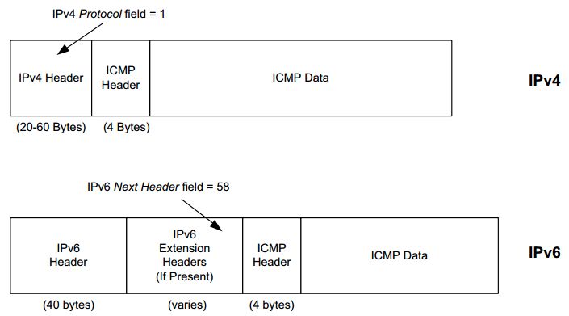

### **Chapter 8. ICMPv4 and ICMPv6: Internet Control Message Protocol**

### Introduction

The IP protocol alone provides no direct way to do the following:

* For an end system to learn the fate of IP packets that fail to make it to their destinations.
* For obtaining diagnostic information (e.g., which routers are used along a path or a method to estimate the round-trip time).

To address these deficiencies, a special protocol called the [**Internet Control Message Protocol**](https://en.wikipedia.org/wiki/Internet_Control_Message_Protocol) (ICMP) is used in conjunction with IP to provide diagnostics and control information related to the configuration of the IP protocol layer and the disposition of IP packets.

ICMP provides for the delivery of error and control messages that may require attention. ICMP messages are usually acted on by:

* The IP layer itself,
* Higher-layer transport protocols (TCP or UDP),
* User applications.

ICMP does not provide reliability for IP; it indicates certain classes of failures and configuration information. The most common cause of packet drops (buffer overrun at a router) does not elicit any ICMP information. Other protocols, such as TCP, handle such situations.

Because of the ability of ICMP to affect the operation of important system functions and obtain configuration information, hackers have used ICMP messages in a large number of attacks. As a result of concerns about such attacks, network administrators often arrange to block ICMP messages with firewalls, especially at border routers. If ICMP is blocked, however, a number of common diagnostic utilities (e.g., ping, traceroute) do not work properly.

The term ICMP refers to ICMP in general, and the terms ICMPv4 and ICMPv6 to refer specifically to the versions of ICMP used with IPv4 and IPv6, respectively. ICMPv6 plays a far more important role in the operation of IPv6 than ICMPv4 does for IPv4.

In IPv6, ICMPv6 is used for several purposes beyond simple error reporting and signaling. It is used for:

* **Neighbor Discovery** (ND), which plays the same role as ARP does for IPv4 ([Chapter 4](ch4.md)).
* **Router Discovery** function used for configuring hosts ([Chapter 6](ch6.md)) and multicast address management ([Chapter 9](ch9.md)).
* Manageing hand-offs in Mobile IPv6.

#### Encapsulation in IPv4 and IPv6

