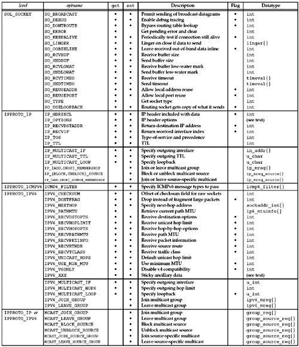

### **Chapter 7. Socket Options**

### Introduction

There are various ways to get and set the options that affect a socket:

* The `getsockopt` and `setsockopt` functions.
* The `fcntl` function, which is the POSIX way to set a socket for nonblocking I/O, signal-driven I/O, and to set the owner of a socket.
* The `ioctl` function.

### `getsockopt` and `setsockopt` Functions

These two functions apply only to sockets:

```c
#include <sys/socket.h>

int getsockopt(int sockfd, int level, int optname, void *optval, socklen_t *optlen);
int setsockopt(int sockfd, int level, int optname, const void *optval socklen_t optlen);

/* Both return: 0 if OK,–1 on error */
```

Arguments:

* *sockfd* must refer to an open socket descriptor.
* *level* specifies the code in the system that interprets the option: the general socket code or some protocol-specific code (e.g., IPv4, IPv6, TCP, or SCTP).
* *optval* is a pointer to a variable from which the new value of the option is fetched by `setsockopt`, or into which the current value of the option is stored by `getsockopt`. The size of this variable is specified by the final argument *optlen*, as a value for `setsockopt` and as a value-result for `getsockopt`.

The following table lists socket and IP-layer socket options for `getsockopt` and `setsockopt`.

[](figure_7.1.png "Figure 7.1. Summary of socket and IP-layer socket options for getsockopt and setsockopt.")

The following table lists transport-layer socket options.

[](figure_7.2.png "Figure 7.2. Summary of transport-layer socket options.")

There are two basic types of options:

* **Flags**: binary options that enable or disable a certain feature (flags)
* **Values**: options that fetch and return specific values that we can either set or examine.

The column labeled "Flag" specifies a flag option:

* `getsockopt`: `*optval` is an integer. The value returned in `*optval` is zero if the option is disabled, or nonzero if the option is enabled.
* `setsockopt`: it requires a nonzero `*optval` to turn the option on, and a zero value to turn the option off.

If the "Flag" column does not contain a block dot, then the option is used to pass a value of the specified datatype between the user process and the system.

### Checking if an Option Is Supported and Obtaining the Default

[sockopt/checkopts.c](https://github.com/shichao-an/unpv13e/blob/master/sockopt/checkopts.c)

### Socket States

### Generic Socket Options

### IPv4 Socket Options

### ICMPv6 Socket Option

### IPv6 Socket Options

### TCP Socket Options
